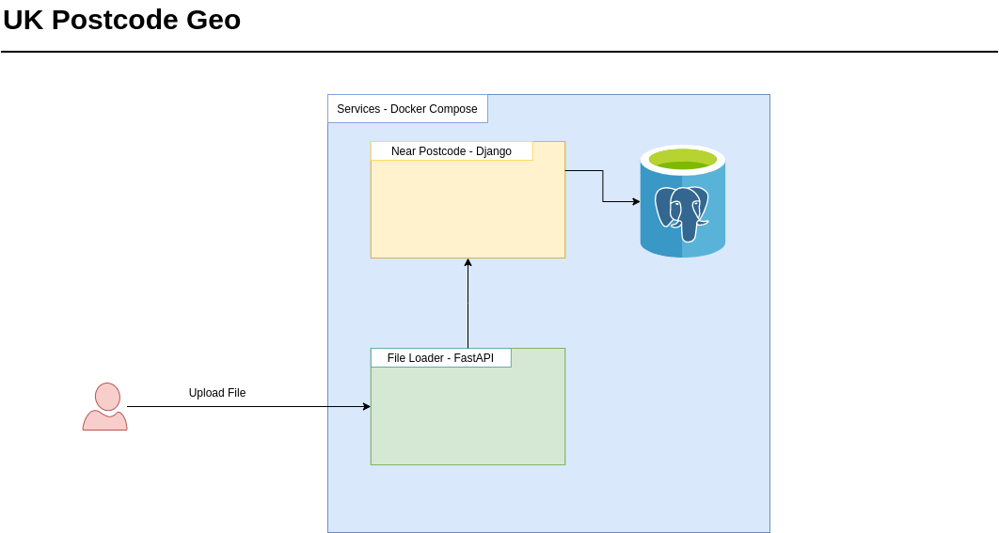

# UK Postcode Geo

Este proyecto esta diseñado para exponer un endpoint que permite cargar un archivo CSV con información de coordenadas geográficas localizadas en Reino Unido, donde al procesarse se identifican los códigos postales más cercanos a cada coordenada y se almacena la información relacionada.

## Instalación

Como requisitos se debe tener instalado [Docker](https://docs.docker.com/engine/install/) y [Docker Compose](https://docs.docker.com/compose/install/).

1. Clonar este repositorio.
2. En la carpeta del proyecto ejecutar `docker-compose up -d`

El proyecto no está configurado para desplegarse en producción, asi que sus funcionalidades pueden probarse localmente.

## Uso del Endpoint
Podrá utilizar la herramienta que desee para consumir el endpoint, pero el proyecto esta configurado con [Swagger](https://swagger.io/), que facilita el desarrollo de APIs. En un navegador ingresar a la dirección `localhost:8001/docs`. Desde la interfaz que se muestra podrá fácilmente cargar un archivo al proyecto y ver el resultado de la operación. El contenido de la respuesta será un objeto JSON indicando que el archivo fue procesado sin problemas o que no pudo ser procesado o que fue procesado pero tiene algunos problemas, caso en el que se indica los tipos de problemas y las filas donde se encontraron.

El archivo debe ser un CSV separado por comas. En este archivo solo las 2 primeras columnas deben ser usadas. El nombre de la primera columna debe ser `lat` y debe contener información de las latitudes. El nombre de la segunda columna debe ser `lon` y debe contener información de las longitudes.

## Arquitectura del Proyecto

La siguiente imagen ilustra la arquitectura definida para el proyecto:

El servicio encargado de recibir el archivo esta construido en [FastAPI](https://fastapi.tiangolo.com/), donde se aprovecha su capacidad de realizar operaciones asíncronas, que resulta ideal en tareas que tienen un tiempo de procesamiento considerable, como el tratamiento de archivos. Una vez el archivo se procesa y a medida que se determina la información de los códigos postales más cercanos a cada coordenada, se envían estos a datos a un servicio construido en Django, que finalmente los almacena en una base de datos Postgres.

## Trabajo Futuro
- Implementar tests en el servicio de Django para asegurar completamente la consistencia de los datos.
- Configurar el proyecto para ser desplagado en producción.
- Mejorar el tiempo de procesamiento de los archivos.
